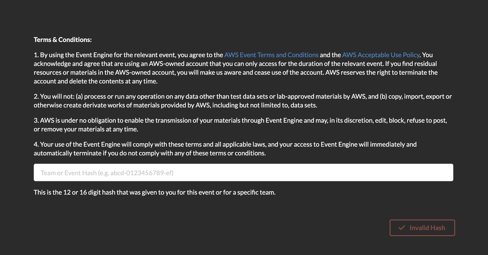
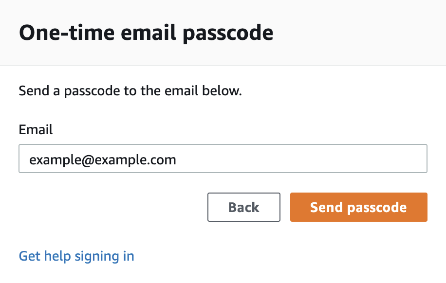

# Workshop Lab Instructions

Instructions for the following labs are in the notebooks. Make sure you see the "Getting started" section below

- Lab 1 : Data Prep
- Lab 2 : Train using Amazon Comprehend
- Lab 3 : Train using a built-in algorithm on SageMaker
- Lab 4 : Train using a custom Script on SageMaker
- Lab 5 : Using SageMaker Pipelines for model comparison 

> Note that Labs 1 through 4 are notebooks in the main workshop folder, and Lab 5 is a folder!

## Getting Started

## Event Engine AWS Account access

Go to: https://dashboard.eventengine.run/login. You will be redirected to the page below.

Enter the event hash you have received from your instructor.

Click on Email One-Time Password (OTP).

You are redirected to the following page:

Enter your email address and click on Send passcode.

You are redirected to the following page:

Check your mailbox, copy-paste the one-time password and click on Sign in.

You are redirected to the Team Dashboard. Click on AWS Console.

On the next screen, click on Open AWS Console.

You are then redirected to the AWS Console.

## Amazon SageMaker Studio access

Amazon SageMaker Studio is a web-based, integrated development environment (IDE) for machine learning that lets you build, train, debug, deploy, and monitor your machine learning models. Studio provides all the tools you need to take your models from experimentation to production while boosting your productivity.

If the AWS Account has been provisioned by your AWS Instructor, follow the next steps to access the SageMaker Studio environment:

1. Open AWS console and switch to AWS region communicated by your instructor.

2. Under services search for Amazon SageMaker.

3. Under Get Started, click on the orange button SageMaker Studio.

4. A SageMaker Studio environment should already be provisioned. Click on Open Studio (on the right side of the preprovisioned sagemakeruser username).

5. The page can take 1 or 2 minutes to load when you access SageMaker Studio for the first time.

6. You will be redirected to a new web tab that looks like this:

7. Under Utilities and files click on System terminal

8. In the terminal, type the following command:

git clone https://github.com/w601sxs/sagemaker-nlp-workshop-data.git

9. After completion of step 8 you will have sagemaker-nlp-workshop-data folder created in left panel of the studio:

10. All labs are placed inside the "workshop" folder, and you can get started with Lab 1

